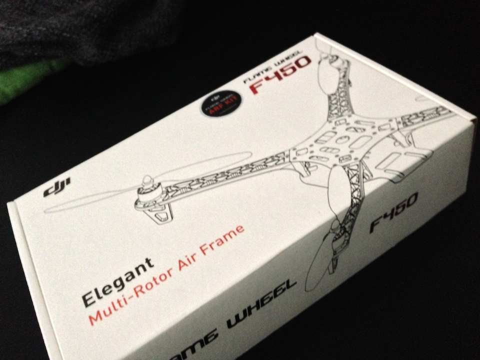
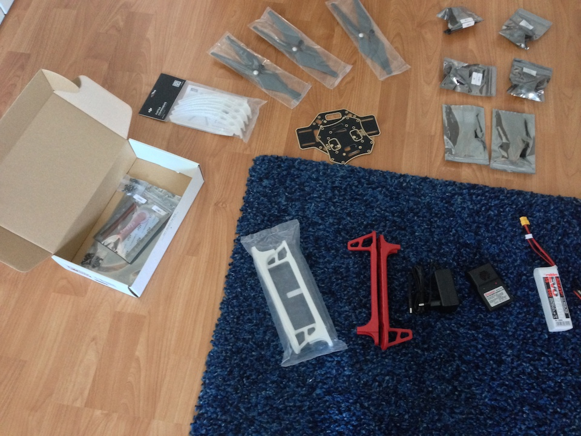
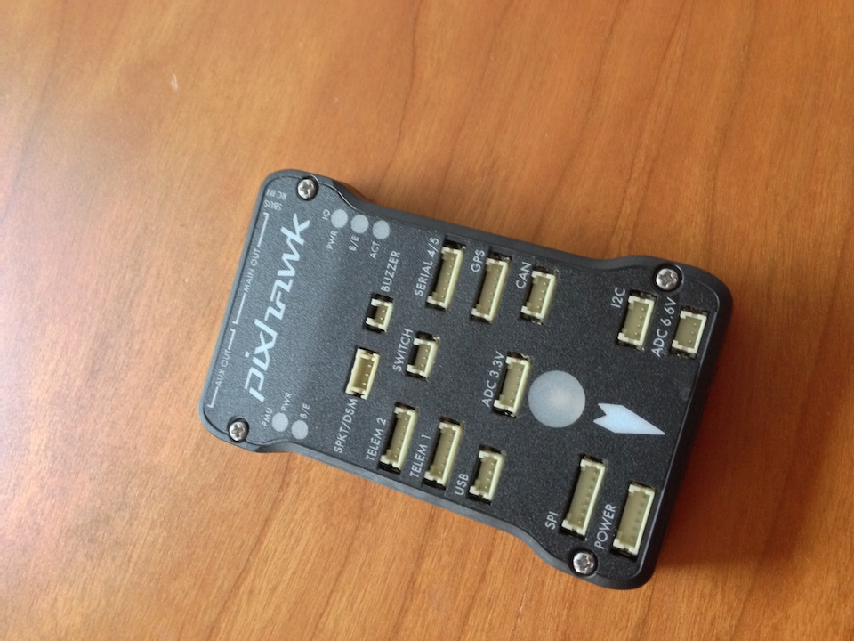

Today, let's see what parts are needed to build a quadcopter.

The hardware is basically a frame with 4 arms, 4 motors with an electronic speed
controller (ESC) for each motor, 4 propellers, a power distribution board (PDB), and a
LiPo battery. Most important, the flight controller is a small computing unit that
controls input for the ESCs/motors.

Let's start with the frame, motors, and the stuff. I decided to build my copter based
on a [DJI Flamewheel]("http://www.dji.com/product/flame-wheel-arf") frame.

There are lots of blog posts on the internet on what frame you should choose. Depending
on the frame's wing-span you need motors, ESCs, and propellers that produce enough power
to carry the quadcopter. All of these parts need to fit to each other. For example, the
wing-span requires a certain propeller size, but a certain propeller size needs suitable
motors and ESCs that are interoperable. Experienced quadcopter guys can tell you more
precisely how these things are related to each other.

If you're a beginner like me, the easiest way is to choose an "Almost Ready to Fly"
(ARF)-Kit. These kits ship with all the parts mentioned above and the parts are 
guaranteed to work with each other. I've also spoken to a friend of mine who build
a copter and he's also used the DJI frames. So, that seems to be a good choice.

The Flamewheels come in different sizes. I've read that the smallest version (330) can
also be used indoor. The larger ones (450, 550) come with nearly the same configuration
and are for outdoor usage. The number tells you what size the copter is; e.g., the 330
has a diagonal wheelbase of 330mm and when used with 4.5in propellers the copter will
have a size of approx. 42x42cm.

I choose the 450 Flamewheel for my quadcopter. One more benefit of the DJI frames is
that they have a built-in power distribution board. You can see the bottom plate and
upper plate in the middle of the picture below. The bottom plate has built-in contacts
to connect the ESCs and batteries. Motors and ESCs are shown in the top right. Battery
and charger are not included (bottom right); you need to buy this in addition. The
landing gear (beneath the propellers) is optional.

The most important part of the quadcopter is the flight controller. It controls the
motors and ESCs, thus powering the quadcopter. Flight controllers also have sensors
such as accelerometers, gyroscopes, and GPS to stabilize and hold the copter's
position. I've decided to buy a [3DR Pixhawk](http://pixhawk.org/modules/pixhawk)
controller because its firmware is open-source
and you can program it in C programming language (that's the one thing software
engineers want to do).

Usually, the flight controller is connected to a radio antenna so that you can steer it
with a remote control. For my purposes, I decided to not buy GPS module and radio
equipment, because I will try to connect an Android smartphone to the Pixhawk (probably
through a USB link). Then, I
will mount the Android on the copter and use its camera, GPS, and wireless to establish
a remote control. I guess that I will try to set-up a WiFi network and then use my other
smartphone to remote control the quadcopter.

For now, the shopping list is:

- DJI Flamewheel 450 ARF Kit, 169,– €, [MHM Modellbau][1] 
- 3S LiPo, at least 2.000-2.500 mAh, ~25,– €, [MHM Modellbau][2]
- LiPo Lader, ~23,– €, [MHM Modellbau][3]
- 3DR Pixhawk 2.4, 200-280,– €, [UAV Store][4]

Moreover, you need some "Kleinscheiss" to assemble the whole thing:

- an XT 60 plug (male connector); it's NOT included in the DJI package!
- Loctide ("Schraubensicherung") from your local store
- a screwdriver set, e.g. this Hama set on [Amazon](http://www.amazon.de/Hama-Mini-Schraubendreher-Etui-13-teilig/dp/B000NRU88E/ref=sr_1_1?ie=UTF8&qid=1401136273&sr=8-1&keywords=macbook+schraubenzieher)
- soldering stuff ("Lötkolben") to connect the wirings
- a voltage meter ("Voltmeter") to check if the wirings are properly connected
- lacquer ("Lötlack") or hot-melt adhesive to cover the solder points
- heat-shrinkable thubes ("Schrumpfschlauch" or "Schrumpelschlauch") for the XT 60 plug
- cable tie ("Kabelbinder") is always a good thing to have

Next time, we'll solder the electrical stuff and assemble the frame.

[1]: http://www.mhm-modellbau.de/part-CP.MX.540005.php "DJI Flamewheel bei MHM Modellbau"
[2]: http://www.mhm-modellbau.de/part-R-6990.php "3S LiPo bei MHM Modellbau"
[3]: http://www.mhm-modellbau.de/part-G-6454.php?utm_source=order-mail&utm_term=item "LiPo Lader bei MHM Modellbau"
[4]: http://www.uav-store.de/autopilot-1/pixhawk/#cc-m-product-8496353793 "Pixhawk bei UAV Store"
