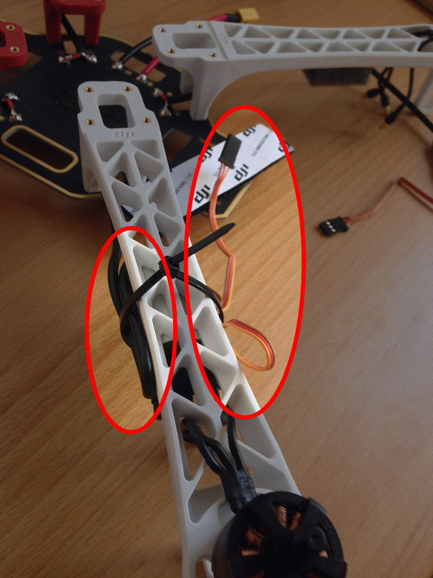

Today, I'll assemble the frame and set up the wirings.

Last time, I forgot to mention a few things that are needed. An [XT 60 plug][10] plug
and [heat-shrinkable tubes][11] ("Schrummppellschlauch") are 
**NOT** included in the DJI package. Also, you should have a voltage meter to check
the wirings before attaching the battery. Lacquer (in German: "Lötlack") or hot-melt
adhesive ("Heißkleber") is recommended to protect the solder points.

**WATCH OUT!**
[A short circuit will set the LiPo battery on fire](http://youtu.be/VLMA9J0PtXM)!

There are lots of frame assembly instructions out on YouTube. The official DJI video
is a good starting point, showing the most important steps in just a few minutes.

<iframe width="560" height="315" src="//www.youtube.com/embed/pUTHIL_Xfcc" frameborder="0" allowfullscreen></iframe>

If you're german speaking, I recommend two more very good videos.

The first one
[shows what things you should prepare and how to solder the wirings][2]. The video gives
more detailed instructions and really helped me to get the soldering right. Especially,
soldering the XT 60 plug is a a bit tricky.

The other dude [has some tips'n'tricks in store][3]. First, don't use hot-melt adhesive.
Lacqure protects the soldering points and will not melt if the circuit heatens up.
Second, it's not a bad thing to put some foam on the underside of the wings so that the
ESCs are protected from vibrations.

A good friend of mine gave me another idea: to reduce electric interference it's good
to have the ESC cables on each side of the wings.

Have a look at the picture below.
The cable that connects the ESC to the battery circuit is on the left side of the wing.
The second wire that connects the ESC to the Pixhawk is on the right side of the wing.
The Pixhawk will be placed where the white DJI stripe is shown on the picture.

That friend also borrowed me the soldering-iron and checked the wirings for me. That
really helped a lot. At this point: Danke, Chris!

Yeah, I'm glad the assembly went well. I'm in a bit of a hurry, though, and have to come
to an end now. Next up is connecting battery and Pixhawk and then run a quick check to
see if the Pixhawk is putting the wheels in motion.

[1]: http://youtu.be/pUTHIL_Xfcc "DJI F450 Setup Demo-Frame Assembly (english)"
[2]: http://youtu.be/OpwBgGllcwg "Frame Assembly Preparations and Soldering, Arthur Konze (german)"
[3]: http://youtu.be/j1uTYKZ7j9s "Frame Assembly Instructions, bunterfisch (german)"
[10]: http://www.conrad.de/ce/de/product/209209/Modelcraft-XT60-Stecker "Modelcraft XT60 Stecker"
[11]: http://www.conrad.de/ce/de/category/SHOP_AREA_110533/Schrumpfschlauch "Schrumpfschlauch"
